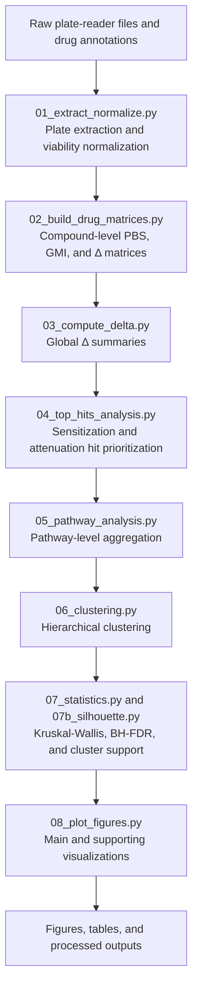
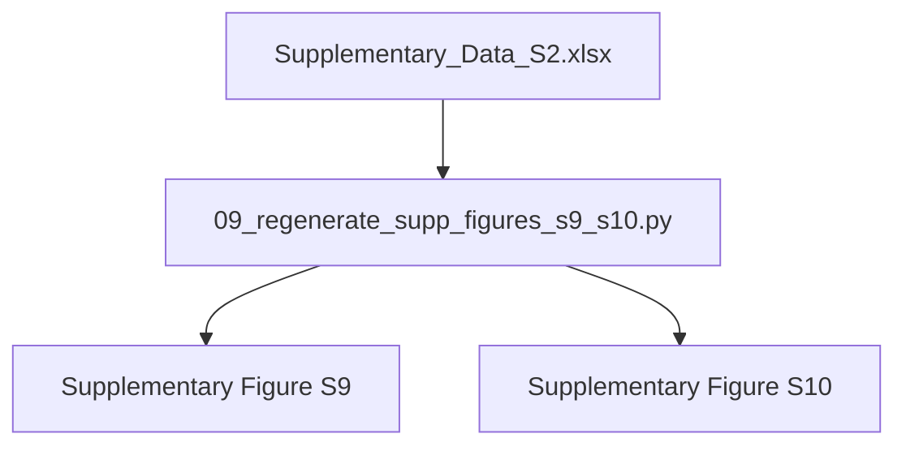

<p align="center">
  
  
  
  <a href="https://doi.org/10.5281/zenodo.21128167">
  
  </a>
</p>

# GMI Paired Functional Screening Analysis

[](LICENSE)
[](CHANGELOG.md)

Computational analysis workflow for paired functional drug screening of GMI-modulated therapeutic responses in heterogeneous ex vivo tumor spheroids.

This repository contains the Python analysis workflow associated with the manuscript:

**Paired functional screening reveals GMI-modulated drug response behavior in heterogeneous tumor models**

The workflow supports processing and analysis of paired ex vivo functional screening data generated under baseline phosphate-buffered saline (PBS) and GMI-modulated conditions. It includes plate-level extraction, viability normalization, compound-level matrix generation, Δ(GMI − PBS) calculation, top-hit prioritization, pathway aggregation, hierarchical clustering, statistical testing, and figure generation. A dedicated script is also provided to regenerate Supplementary Figures S9 and S10 for the ΔMin–ΔAUC sensitivity analysis.

> **Manuscript status:** under revision. Repository metadata should be updated with the final article citation and DOI after manuscript publication.

---

## Repository structure

```text
GMI_Paired_Functional_Screening_Analysis/
├── README.md
├── LICENSE
├── CITATION.cff
├── CHANGELOG.md
├── requirements.txt
├── run_main_pipeline.sh
├── .gitignore
├── .zenodo.json
├── data/
│   └── README.md
├── scripts/
│   ├── 01_extract_normalize.py
│   ├── 02_build_drug_matrices.py
│   ├── 03_compute_delta.py
│   ├── 04_top_hits_analysis.py
│   ├── 05_pathway_analysis.py
│   ├── 06_clustering.py
│   ├── 07_statistics.py
│   ├── 07b_silhouette.py
│   ├── 08_plot_figures.py
│   └── 09_regenerate_supp_figures_s9_s10.py
├── supplementary_figures/
│   ├── Supplementary_Figure_S9.pdf
│   ├── Supplementary_Figure_S9.png
│   ├── Supplementary_Figure_S10.pdf
│   └── Supplementary_Figure_S10.png
└── docs/
    ├── GitHub_Zenodo_release_notes.md
    ├── WORKFLOW.md
    └── original_SUPPLEMENTARY_CODE_README.txt
```

No empty placeholder folders are included in this release. Input data should be placed locally according to the instructions in `data/README.md` before running the workflow.

---

## Workflow overview



For the ΔMin–ΔAUC sensitivity analysis:



---

## Major analyses performed

- Raw data extraction and normalization
- Construction of paired PBS and GMI drug-response matrices
- Calculation of ΔMin(GMI − PBS)
- Calculation of ΔAUC(GMI − PBS)
- Compound prioritization and hit identification
- Pathway aggregation using curated drug-target annotations
- Hierarchical clustering of pathway-response profiles
- Kruskal–Wallis statistical analysis
- Benjamini–Hochberg false discovery rate correction
- Spearman correlation analysis
- Silhouette analysis
- Generation of publication-quality figures
- Regeneration of Supplementary Figures S9 and S10

---

## Requirements

The workflow was developed using Python 3.11 and standard scientific Python packages.

Install dependencies with:

```bash
python -m venv .venv
source .venv/bin/activate  # Windows: .venv\\Scripts\\activate
pip install -r requirements.txt
```

Main dependencies:

- NumPy
- pandas
- SciPy
- scikit-learn
- matplotlib
- seaborn
- openpyxl

---

## Input data

The main workflow expects input files in a local `data_raw/` directory. See `data/README.md` for the expected input structure.

Key expected inputs include:

- raw plate-reader Excel files under `data_raw/cases/`
- `data_raw/drug_lookup.xlsx`, containing compound annotations and assay-well lookup tables
- `data/Supplementary_Data_S2.xlsx`, for regenerating Supplementary Figures S9 and S10

Raw screening files are not included in this repository release. Representative processed datasets are provided in the manuscript Supplementary Data files, and additional processed datasets are available from the corresponding author upon reasonable request.

---

## Running the main analysis workflow

After placing the required input data in the expected locations, run:

```bash
bash run_main_pipeline.sh
```

The scripts are numbered in execution order:

1. `01_extract_normalize.py` — extracts plate matrices and performs viability normalization.
2. `02_build_drug_matrices.py` — converts normalized plate matrices into compound-level PBS, GMI, and Δ matrices.
3. `03_compute_delta.py` — summarizes global Δ(GMI − PBS) distributions.
4. `04_top_hits_analysis.py` — identifies top sensitization- and attenuation-associated compound shifts.
5. `05_pathway_analysis.py` — aggregates compound-level responses by curated pathway category.
6. `06_clustering.py` — performs hierarchical clustering of pathway-level modulation profiles.
7. `07_statistics.py` — performs pathway-level Kruskal–Wallis and BH-FDR statistical analyses.
8. `07b_silhouette.py` — performs supporting cluster-quality analysis.
9. `08_plot_figures.py` — generates heatmap-based figures and supporting plots.

---

## Regenerating Supplementary Figures S9 and S10

To regenerate the ΔMin–ΔAUC sensitivity analysis figures, place `Supplementary_Data_S2.xlsx` in the `data/` folder and run:

```bash
python scripts/09_regenerate_supp_figures_s9_s10.py
```

The script writes outputs to:

```text
outputs/AUC_regenerated_figures/
```

A copy of the regenerated Supplementary Figure S9 and S10 files is included in the `supplementary_figures/` folder.

---

## Expected outputs

Depending on the available inputs, the workflow generates output folders such as:

- `normalized_output/`
- `drug_level_output_all178/`
- `drug_level_output_secondary_all178/`
- `top_hits_output/`
- `tables/`
- `figures/`
- `heatmap_output_178_final/`
- `outputs/AUC_regenerated_figures/`

---

## Data availability

Representative processed datasets are provided with the manuscript as Supplementary Data S1 and Supplementary Data S2. Raw screening files are not included in this repository release. Additional processed datasets supporting the findings of this study are available from the corresponding author upon reasonable request.

---

## Citation

If you use this workflow, please cite the archived repository release and the associated manuscript after manuscript publication.

GitHub repository:

```text
https://github.com/ATShivanna/GMI_Paired_Functional_Screening_Analysis
```

A `CITATION.cff` file is included so that GitHub can display citation metadata after repository publication. After Zenodo archiving, this section should be updated with the release DOI.

---

## License

This code is released under the MIT License. See `LICENSE` for details.

---

## Contact

For questions about the computational workflow, please contact the Maintainer listed in the associated manuscript.


## Repository maintainer

**Dr. Anilkumar T. Shivanna**  
First Author  
MatchCure Inc.  
Email: anilkumar.shivanna@imatchcure.com
